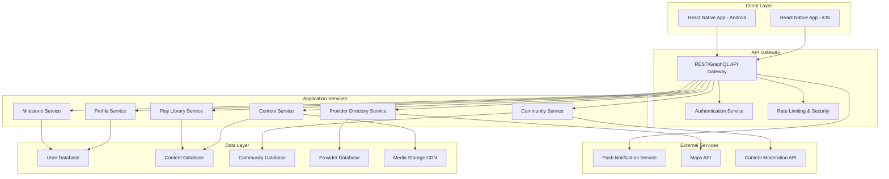

# Design Document

## Overview

Neo-Nest MVP is a hybrid mobile application built using React Native to provide cross-platform support for iOS and Android. The app follows a mobile-first architecture with a modular backend API design, focusing on corrected age calculations, milestone tracking, content delivery, and community features for parents of preterm babies.

The system prioritizes data security, clinical validation workflows, and user experience optimization while maintaining scalability for future feature expansion.

## Architecture

### High-Level Architecture



### Technology Stack

**Frontend (React Native)**
- React Native 0.72+ for cross-platform mobile development
- TypeScript for type safety and better developer experience
- React Navigation for screen navigation
- React Hook Form for form management
- AsyncStorage for local data persistence
- React Native Push Notifications for engagement

**Backend Services**
- Node.js with Express.js for API services
- GraphQL with Apollo Server for flexible data querying
- JWT for authentication and session management
- Prisma ORM for database operations
- Redis for caching and session storage

**Database & Storage**
- PostgreSQL for primary data storage
- AWS S3 or similar for media file storage
- CloudFront CDN for content delivery
- Encrypted storage for all PII/PHI data

**Infrastructure**
- AWS/Azure cloud services for scalability
- Docker containers for service deployment
- CI/CD pipeline for automated testing and deployment
- Monitoring and logging with CloudWatch/Application Insights

## Components and Interfaces

### Core Components

#### 1. Authentication & Profile Management
```typescript
interface UserProfile {
  id: string;
  email: string;
  parentName: string;
  babies: BabyProfile[];
  preferences: UserPreferences;
  createdAt: Date;
  updatedAt: Date;
}

interface BabyProfile {
  id: string;
  name?: string;
  birthDate: Date;
  dueDate: Date;
  correctedAge: number; // calculated field
  gender?: 'male' | 'female' | 'other';
  birthWeight?: number;
  milestones: Milestone[];
}
```

#### 2. Milestone Tracking System
```typescript
interface Milestone {
  id: string;
  babyId: string;
  category: MilestoneCategory;
  description: string;
  achievedDate?: Date;
  status: 'not_started' | 'in_progress' | 'achieved' | 'delayed';
  correctedAgeAtAchievement?: number;
  media?: MediaFile[];
  notes?: string;
}

interface MilestoneCategory {
  id: string;
  name: string;
  ageRangeStart: number; // weeks
  ageRangeEnd: number;
  isPreterm: boolean;
}
```

#### 3. Content Management System
```typescript
interface Content {
  id: string;
  title: string;
  type: 'article' | 'video' | 'infographic';
  content: string;
  mediaUrl?: string;
  ageRanges: number[];
  categories: string[];
  clinicalReview: ClinicalReview;
  publishedAt: Date;
  updatedAt: Date;
}

interface ClinicalReview {
  reviewerId: string;
  reviewerName: string;
  reviewerCredentials: string;
  reviewDate: Date;
  approvalStatus: 'pending' | 'approved' | 'rejected';
  notes?: string;
}
```

#### 4. Community Forum
```typescript
interface ForumPost {
  id: string;
  authorId: string;
  title: string;
  content: string;
  category: string;
  moderationStatus: 'pending' | 'approved' | 'flagged' | 'removed';
  replies: ForumReply[];
  createdAt: Date;
  updatedAt: Date;
}

interface ForumReply {
  id: string;
  postId: string;
  authorId: string;
  content: string;
  isExpertReply: boolean;
  moderationStatus: 'pending' | 'approved' | 'flagged' | 'removed';
  createdAt: Date;
}
```

#### 5. Play Library System
```typescript
interface PlayActivity {
  id: string;
  title: string;
  description: string;
  ageRangeStart: number;
  ageRangeEnd: number;
  materials: string[];
  safetyNotes: string[];
  skillTargets: string[];
  duration: number; // minutes
  difficulty: 'easy' | 'medium' | 'hard';
  media?: MediaFile[];
}
```

### API Interfaces

#### GraphQL Schema Structure
```graphql
type Query {
  me: User
  baby(id: ID!): Baby
  milestones(babyId: ID!): [Milestone]
  content(ageRange: Int, category: String): [Content]
  forumPosts(category: String, limit: Int): [ForumPost]
  playActivities(correctedAge: Int, materials: [String]): [PlayActivity]
  providers(location: String, specialty: String): [Provider]
}

type Mutation {
  createBaby(input: BabyInput!): Baby
  updateMilestone(id: ID!, input: MilestoneInput!): Milestone
  createForumPost(input: ForumPostInput!): ForumPost
  savePlayActivity(activityId: ID!): Boolean
}
```

## Data Models

### Database Schema Design

#### Users Table
```sql
CREATE TABLE users (
  id UUID PRIMARY KEY DEFAULT gen_random_uuid(),
  email VARCHAR(255) UNIQUE NOT NULL,
  password_hash VARCHAR(255) NOT NULL,
  parent_name VARCHAR(255) NOT NULL,
  phone VARCHAR(20),
  timezone VARCHAR(50),
  preferences JSONB,
  created_at TIMESTAMP DEFAULT NOW(),
  updated_at TIMESTAMP DEFAULT NOW()
);
```

#### Babies Table
```sql
CREATE TABLE babies (
  id UUID PRIMARY KEY DEFAULT gen_random_uuid(),
  user_id UUID REFERENCES users(id) ON DELETE CASCADE,
  name VARCHAR(255),
  birth_date DATE NOT NULL,
  due_date DATE NOT NULL,
  gender VARCHAR(10),
  birth_weight DECIMAL(5,2),
  created_at TIMESTAMP DEFAULT NOW(),
  updated_at TIMESTAMP DEFAULT NOW()
);
```

#### Milestones Table
```sql
CREATE TABLE milestones (
  id UUID PRIMARY KEY DEFAULT gen_random_uuid(),
  baby_id UUID REFERENCES babies(id) ON DELETE CASCADE,
  category_id UUID REFERENCES milestone_categories(id),
  description TEXT NOT NULL,
  achieved_date DATE,
  status VARCHAR(20) DEFAULT 'not_started',
  corrected_age_at_achievement INTEGER,
  notes TEXT,
  media_urls JSONB,
  created_at TIMESTAMP DEFAULT NOW(),
  updated_at TIMESTAMP DEFAULT NOW()
);
```

### Corrected Age Calculation Logic
```typescript
function calculateCorrectedAge(birthDate: Date, dueDate: Date): number {
  const now = new Date();
  const chronologicalAgeMs = now.getTime() - birthDate.getTime();
  const prematureWeeksMs = dueDate.getTime() - birthDate.getTime();
  
  // If born at or after 37 weeks, use chronological age
  if (prematureWeeksMs <= 0) {
    return Math.floor(chronologicalAgeMs / (1000 * 60 * 60 * 24 * 7));
  }
  
  const correctedAgeMs = chronologicalAgeMs - prematureWeeksMs;
  return Math.max(0, Math.floor(correctedAgeMs / (1000 * 60 * 60 * 24 * 7)));
}
```

## Error Handling

### Error Classification
1. **Client Errors (4xx)**
   - Authentication failures
   - Validation errors
   - Resource not found
   - Rate limiting

2. **Server Errors (5xx)**
   - Database connection issues
   - External service failures
   - Unexpected application errors

### Error Response Format
```typescript
interface ErrorResponse {
  error: {
    code: string;
    message: string;
    details?: any;
    timestamp: string;
    requestId: string;
  };
}
```

### Error Handling Strategy
- Graceful degradation for non-critical features
- Offline capability for essential functions
- User-friendly error messages with actionable guidance
- Automatic retry logic for transient failures
- Comprehensive logging for debugging

## Testing Strategy

### Testing Pyramid

#### Unit Tests (70%)
- Pure function testing for corrected age calculations
- Component logic testing with Jest
- Database model validation
- API endpoint unit tests

#### Integration Tests (20%)
- API service integration testing
- Database integration tests
- External service mock testing
- End-to-end user flow testing

#### E2E Tests (10%)
- Critical user journey testing with Detox
- Cross-platform compatibility testing
- Performance testing under load
- Security penetration testing

### Testing Tools
- **Jest** for unit and integration testing
- **React Native Testing Library** for component testing
- **Detox** for E2E mobile testing
- **Supertest** for API testing
- **Cypress** for web admin panel testing

### Continuous Testing
- Automated test execution on every commit
- Performance regression testing
- Security vulnerability scanning
- Accessibility compliance testing

### Test Data Management
- Synthetic test data generation
- HIPAA-compliant test environments
- Data anonymization for testing
- Automated test data cleanup

## Security Considerations

### Data Protection
- End-to-end encryption for sensitive data
- HIPAA compliance for health information
- GDPR compliance for EU users
- Regular security audits and penetration testing

### Authentication & Authorization
- JWT-based authentication with refresh tokens
- Role-based access control (RBAC)
- Multi-factor authentication for admin users
- Session management and timeout policies

### API Security
- Rate limiting to prevent abuse
- Input validation and sanitization
- SQL injection prevention
- CORS configuration for web clients